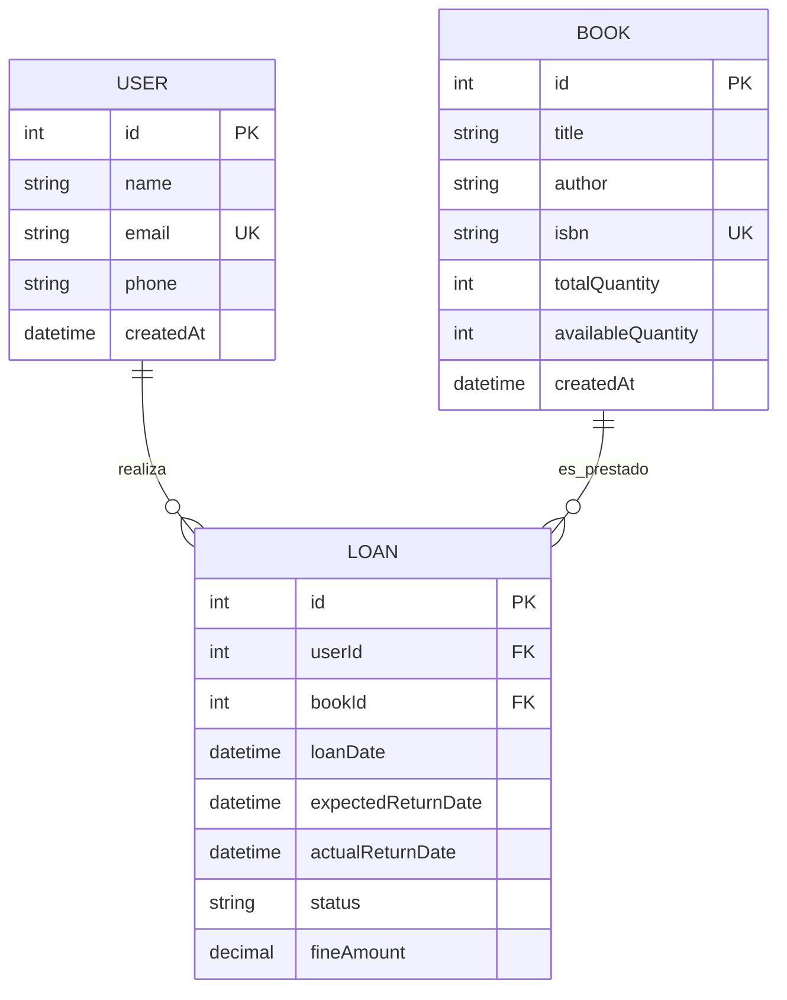

# Modelo entidad-relación

```mermaid
erDiagram
  USER ||--o{ LOAN : realiza
  BOOK ||--o{ LOAN : es_prestado

  USER {
    int id PK
    string name
    string email UK
    string phone
    datetime createdAt
  }

  BOOK {
    int id PK
    string title
    string author
    string isbn UK
    int totalQuantity
    int availableQuantity
    datetime createdAt
  }

  LOAN {
    int id PK
    int userId FK
    int bookId FK
    datetime loanDate
    datetime expectedReturnDate
    datetime actualReturnDate
    string status
    decimal fineAmount
  }
```
